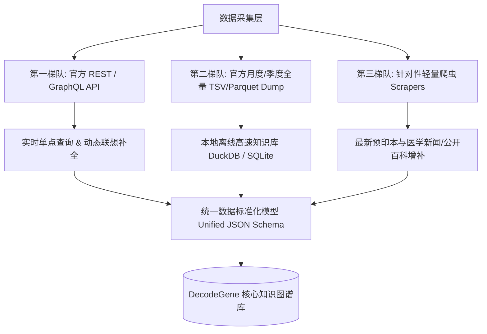

# 🧬 全球基因与疾病公开数据源与 API 集成全景手册
### Gene-Disease Open Data Sources, Public APIs & Scraper Guidelines

本手册为 **DecodeGene** 项目提供完整的数据源获取、API 规范、公开数据集批量下载以及网络爬虫策略。

---

## 一、权威开放数据源一览表 (Overview of Authoritative Sources)

| 数据库名称 | 核心数据类型 | 访问方式 | 认证需求 | 开源/商用友好度 | 官方地址 / API 文档 |
| :--- | :--- | :--- | :--- | :--- | :--- |
| **Open Targets Platform** | 靶点-疾病关联、临床试验、成药性 | GraphQL API / Parquet Dump | 免费无需 Key | 极高 (Apache 2.0 / CC0) | [Open Targets API](https://api.platform.opentargets.org/) |
| **NCBI ClinVar** | 遗传突变临床致病性分类 (Pathogenicity) | E-utilities REST API / TSV Dump | 免费 (带 Key 提高 QPS) | 极高 (Public Domain CC0) | [ClinVar FTP](https://ftp.ncbi.nlm.nih.gov/pub/clinvar/) |
| **Human Phenotype Ontology (HPO)** | 人类表型与罕见病-基因映射关系 | REST API / TSV 直接下载 | 免费无需 Key | 极高 (CC-BY 4.0) | [HPO Download](https://hpo.jax.org/app/data/annotations) |
| **GenCC (Gene Curation Coalition)** | 专家共识评定之基因-疾病关联有效性 | TSV 批量直接下载 | 免费无需 Key | 极高 (CC0 / CC-BY) | [GenCC Data](https://thegencc.org/) |
| **MyGene.info** | 基因别名、功能定义、跨物种同源基因 | 高性能 REST API | 免费无需 Key | 极高 (CC-BY 4.0) | [MyGene.info API](https://mygene.info/v3/api) |
| **GWAS Catalog (EBI)** | 全基因组关联分析 SNP-性状关联 | REST API / TSV Dump | 免费无需 Key | 极高 (CC0 / Free to use) | [GWAS Catalog API](https://www.ebi.ac.uk/gwas/rest/docs/api) |
| **DisGeNET** | 基因-疾病关联评分 (100万+条) | REST API / TSV Dump | 需注册申请 API Key | 学术免费 (CC-BY-NC-SA) | [DisGeNET API](https://api.disgenet.com/) |
| **Orphadata (Orphanet)** | 罕见病分类、致病基因与流行病学 | XML / JSON / REST API | 免费 (CC-BY 4.0) | 极高 | [Orphadata](https://www.orphadata.com/) |
| **Europe PMC / PubMed** | 生物医学文献全文与摘要 | REST / E-utilities API | 免费 | 极高 | [Europe PMC API](https://europepmc.org/RestfulWebService) |

---

## 二、数据获取策略：三层梯队架构 (Three-Tier Data Strategy)



---

## 三、各数据源详细接入指南 (Data Source Integration Guides)

### 1. Open Targets Platform (优先推荐：GraphQL API)
Open Targets 是目前最现代化的靶点-疾病数据平台，提供功能极强的 GraphQL API。

- **Endpoint**: `https://api.platform.opentargets.org/api/v4/graphql`
- **查询示例 (查询 BRCA1 关联的疾病与综合关联分)**:
```graphql
query TargetDiseases {
  target(ensemblId: "ENSG00000012048") {
    id
    approvedSymbol
    approvedName
    associatedDiseases(page: { size: 10, index: 0 }) {
      count
      rows {
        disease {
          id
          name
        }
        score
        datatypeScores {
          id
          score
        }
      }
    }
  }
}
```

### 2. NCBI ClinVar (突变与临床致病性)
ClinVar 是判断基因突变是“致病 (Pathogenic)”还是“良性 (Benign)”的黄金标准。

- **方案 A (实时检索 - E-utilities API)**:
  ```text
  GET https://eutils.ncbi.nlm.nih.gov/entrez/eutils/esearch.fcgi?db=clinvar&term=TP53[gene]+AND+Li-Fraumeni[disorder]&retmode=json
  ```
- **方案 B (全量离线批处理 - 推荐)**:
  - 直接下载每月更新的 `variant_summary.txt.gz`:
  - URL: `https://ftp.ncbi.nlm.nih.gov/pub/clinvar/tab_delimited/variant_summary.txt.gz`
  - 字段包含：`GeneSymbol`, `VariationID`, `ClinicalSignificance`, `PhenotypeList`, `ReviewStatus`。

### 3. Human Phenotype Ontology (HPO 表型与疾病)
HPO 是罕见病与症状表型最标准的本体库。

- **直接下载数据文件**:
  - `genes_to_phenotype.txt`: `http://purl.obolibrary.org/obo/hp/hpoa/genes_to_phenotype.txt`
  - `phenotype_to_genes.txt`: `http://purl.obolibrary.org/obo/hp/hpoa/phenotype_to_genes.txt`
- **数据结构**:
  - `gene_id`, `gene_symbol`, `hpo_id`, `hpo_term_name`, `disease_id` (OMIM/ORPHA).

### 4. GenCC (Gene Curation Coalition 权威共识)
整合了 ClinGen、Orphanet、Genomics England 等 12 家顶级机构对基因-疾病关联有效性的评级（Definitive, Strong, Moderate, Limited, Disputed）。

- **直接下载 TSV**:
  - URL: `https://search.thegencc.org/download/action/gencc-submissions.tsv`
- **特点**: 数据体量轻（约几万行精修数据），适合直接作为高质量基准表内置于项目中。

### 5. MyGene.info (极速基因元数据)
- **Endpoint**: `https://mygene.info/v3/query`
- **查询示例**:
  - 模糊搜索: `https://mygene.info/v3/query?q=BRCA1&fields=symbol,name,summary,genomic_pos,type_of_gene`
  - 批量查询: 支持 POST 请求一次查询几千个基因符号。

---

## 四、网络爬虫设计与边界规范 (Web Scraping Guidelines)

在生物医药领域，**强烈优先使用公开 API 与直接下载数据包**，因为数据更准确且结构化。但在以下场景可启用轻量爬虫：

### 1. 爬虫适用场景
- **场景 1: PubMed / bioRxiv / medRxiv 最新预印本摘要**:
  - 抓取近 7 天内提及特定罕见基因突变的最新论文标题、摘要与 DOI。
- **场景 2: OMIM 摘要卡片 (补充信息)**:
  - 当没有 OMIM 官方商业授权 API 时，通过公开摘要页面提取基本临床症状描述（遵循 `robots.txt`，限制并发 1 req/sec）。

### 2. 爬虫开发守则
- **User-Agent 规范**: 明确声明开源项目标识（如 `User-Agent: DecodeGene-Bot/1.0 (+https://github.com/tkarnatar/DecodeGene)`）。
- **频率限制 (Rate Limiting)**: 使用 `asyncio.Semaphore` 或 `limiter` 保持请求间隔在 1.0~2.0 秒以上。
- **本地缓存**: 所有爬取内容必须以 SHA256 为 Hash 键缓存至本地 SQLite / Redis，避免重复请求目标站点。
